# 영화추천서비스 Pjt


## 1. 팀원 정보 및 업무 분담 내역

* 조 이름 : 소년하다( `sonyeonhada-movie` )

|                          손현희                           |                  하다연                  |
| :-------------------------------------------------------: | :--------------------------------------: |
|               서비스 및 알고리즘 구성 기획                |       서비스 및 알고리즘 구성 기획       |
|                  영화 추천 알고리즘 구현                  |           페이지 구성 및 기획            |
| user가 좋아요 하는 영화를 기반으로 추천하는 알고리즘 구현 |     영화 seed 데이터 생성(웹크롤링)      |
|       user와 취향이 비슷한 user 목록 알고리즘 구현        |      accounts signup/login/out 기능      |
|    movie_list / movie_detail 페이지 구현(좋아요 기능)     |     user_page의 user_image 변경 기능     |
|                      영화 검색 기능                       |   user_page의 user 상세 정보 수정 기능   |
|         영화 디테일 페이지 review 생성, 삭제 기능         | django_admin 관리자 영화, 유저 관리 기능 |
|    user_page의 좋아요 누른 영화 slideshow 로 보여주기     |                    -                     |
|          user_page의 담벼락 댓글 생성, 삭제 기능          |                    -                     |
|                         CSS 전반                          |                    -                     |


## 2. 목표 서비스 구현 및 실제 구현 정도

* 목표 서비스

  1. `개인화된 영화 추천 사이트` 구현(장르 기반, 회원 가입 시 좋아하는 영화 리스트를 받아 장르 분석)

  2. `나와 비슷한 영화 취향을 가진 다른 회원`들과 채팅창으로 소통(+ 추후 보완 과제)

* 실제 구현 정도

  * (1번) 유저별 선호하는 2가지 장르를 유저 정보에 함께 저장하기 성공!
  * (2번) 단일 채팅창 구현에는 성공했으나 다중 채팅창을 만들고 유지하는 것에 어려움을 느껴, 유저의 개인 페이지에 `담벼락` 기능으로 대체함.
    * 메인 화면에서 나와 영화 취향이 비슷한 다른 유저 리스트를 보여주고, 그 회원의 개인 페이지에 들어가 `담벼락` 에 글을 남겨 채팅방의 역할을 하도록 함.
    * 채팅으로 소통하는 느낌의 사용자 경험을 주기 위해서 내가 쓴 글은 담벼락의 오른쪽에, 상대방 유저가 쓴 글은 담벼락 왼쪽에 위치. 
  * (2번 추후 보완) 추후 비슷한 영화 취향의 유저들이 함께 참여하는 실시간 채팅방 구현이 목표.


## 3. 데이터베이스 모델링(ERD)

* 각 유저는 프로필 사진을 등록할 수 있음(OneToOneField 로 연결)
* 각 유저는 가장 선호하는 장르 2가지가 저장되고 이는 accounts_user_like_genre 테이블에 저장됨
* 각 유저는 담벼락을 가지고 있으며 담벼락에 남긴 글은 `페이지 주인 id` 와 `글을 남긴 유저 id`와 `글 내용` 을  담은 Damgle 이라는 테이블에 저장됨


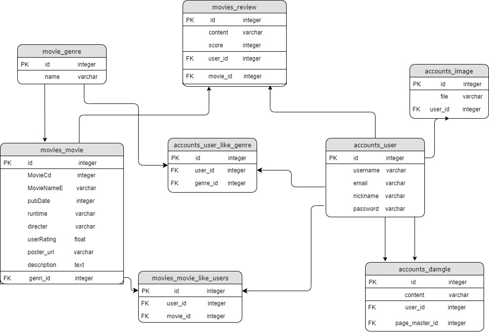


## 4. 핵심 기능 안내

#### 1. Seed Data 구성

- 네이버 영화 (https://movie.naver.com/) 에서 총 1926개 영화 정보 크롤링

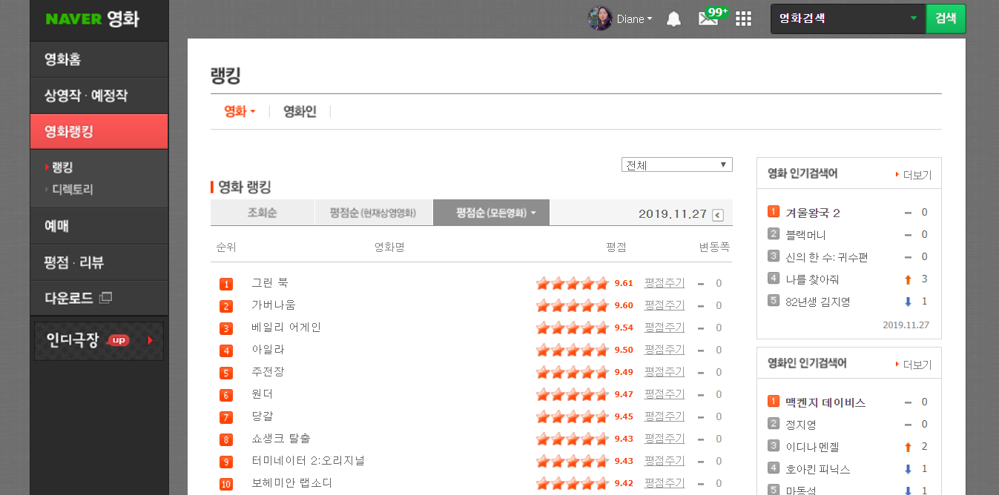

- 개발자 선정 장르별 영화 90개 목록(`네이버 조회순 랭킹이 높은 영화`)으로 회원가입 때 유저의 영화 장르별 취향 파악
- 네이버 영화 사이트에서 `평점순 다양한 장르의 영화` 데이터 1800여개 크롤링
- 네이버 영화 검색 API에서 제공하는 장르 코드 사용해 영화 분류

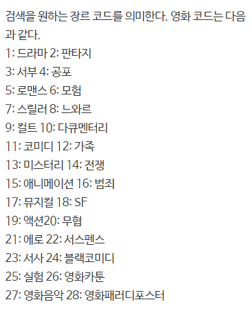

* csv 파일로 크롤링 후 genre.json 와 movie.json 파일 생성 - loaddata로 DB 테이블 저장


#### 2. 추천 알고리즘

##### 	2-1. 영화 추천 알고리즘

- user가 회원가입을 하게 되면 choice page로 이동
- choice page에서 다양한 장르의 영화 목록이 나오면, user는 좋아하는 영화를 고름
- user가 고른 영화들은 accounts의 'checked' url을 통해 views의 checked 함수를 실행
- checked 함수는 user가 고른 영화들의 장르를 확인하고 그 중 가장 많이 고른 장르와 두번째로 많이 고른 장르를 user가 좋아하는 장르로 저장
- user가 가장 좋아하는 장르에서 가장 평점이 높은 영화를 movie_list 오늘의 추천 영화에 보여주고, 추천 list에 좋아하는 장르들에서 평점이 높은 영화 18개를 선정하여 보여준다. 

```python
accounts/views.py 중 checked 함수 부분

@login_required
def checked(request):
    if request.method == "POST":
        # 어떤 장르 영화를 좋아하는 지
        genre = [0]*28
        checked_list = request.POST.getlist('checked_data')
        print(checked_list)
        user = request.user
        for i in checked_list:
            genre_id, movie_id = i.split(',')
            genre[int(genre_id)] += 1
            movie = get_object_or_404(Movie, id = int(movie_id))
            user.like_movies.add(movie)
        max_point1, max_idd1, max_point2, max_idd2 = 0, 0, 0, 0
        for j in range(28):
            if max_point1 < genre[j]:
                max_point1 = genre[j]
                max_idd1 = j
            else:
                if max_point2 < genre[j]:
                    max_point2 = genre[j]
                    max_idd2 = j
        genre1 = get_object_or_404(Genre, id=max_idd1)
        genre2 = get_object_or_404(Genre, id=max_idd2)
        user.like_genres.add(genre1)
        user.like_genres.add(genre2)

        # 추천 알고리즘
        movie = Movie.objects.filter(genre_id=genre1).order_by('-userRating').distinct()[0]
        genre = get_object_or_404(Genre, id=movie.genre_id)
        movies1 = Movie.objects.filter(genre_id=genre1).order_by('-userRating').distinct()[1:10]
        movies2 = Movie.objects.filter(genre_id=genre2).order_by('-userRating').distinct()[:9]
        
        # 취향 비슷한 사람 찾기
        users = []
        for user1 in User.objects.all():
            genre_li = []
            for like_genre in user1.like_genres.all():
                genre_li.append(like_genre.id)
            if sorted(genre_li) == sorted([max_idd1, max_idd2]) and user1.id != user.id:
                users.append(user1)
        if not users:
            users = User.objects.all()
        return render(request, 'movies/movie_list.html', {
            'movie': movie,
            'genre': genre,
            'movies1' : movies1,
            'movies2' : movies2,
            'users': users,
        })
```


##### 		2-2. 유저 영화 취향 갱신 알고리즘

* 유저가 각 영화의 movie_detail 페이지로 이동해 `좋아요`를 누를 때마다 유저의 영화 취향 정보 갱신
* 좋아요 누른 영화들의 장르를 반영해 계산 후 가장 선호하는 장르1, 장르2를 갱신

```python
movies/views.py 중

@login_required
@require_POST
def toggle_like(request, movie_id):
    movie = get_object_or_404(Movie, id=movie_id)
    user = request.user
    # 좋아요를 누른 유저라면
    if movie.like_users.filter(id=user.id).exists():
        movie.like_users.remove(user)
    else:
        movie.like_users.add(user)
    genre = [0]*28
    for user_movie in user.like_movies.all():
        genre[user_movie.genre_id] += 1
    max_point1, max_idd1, max_point2, max_idd2 = 0, 0, 0, 0
    for j in range(28):
        if max_point1 < genre[j]:
            max_point1 = genre[j]
            max_idd1 = j
        else:
            if max_point2 < genre[j]:
                max_point2 = genre[j]
                max_idd2 = j
    for i in user.like_genres.all():
        user.like_genres.remove(i)
    genre1 = get_object_or_404(Genre, id=max_idd1)
    genre2 = get_object_or_404(Genre, id=max_idd2)
    user.like_genres.add(genre1)
    user.like_genres.add(genre2)
    return redirect('movies:movie_detail', movie.id)
```


##### 	2-3. '나와 영화 취향이 비슷한 유저들' 추천 알고리즘

* 유저가 movie_list 페이지로 이동할 때, 타 유저들 중 선호하는 장르 1, 2 가 같은 유저들의 목록을 보여줌
* 영화 취향이 일치하는 타 유저가 존재하지 않을 경우, 모든 유저들을 목록으로 보여줌

```python
movies/views.py 중

@login_required
def movie_list(request):
    user = request.user
    genres = user.like_genres.all()
    li = []
    users = []
    for genre in genres:
        li.append(genre.id)
    movie = Movie.objects.filter(genre_id=li[0]).order_by('-userRating').distinct()[0]
    genre = get_object_or_404(Genre, id=movie.genre_id)
    movies1 = Movie.objects.filter(genre_id=li[0]).order_by('-userRating').distinct()[1:10]
    movies2 = Movie.objects.filter(genre_id=li[1]).order_by('-userRating').distinct()[:9]

    for user1 in User.objects.all():
        genre_li = []
        for like_genre in user1.like_genres.all():
            genre_li.append(like_genre.id)
        if sorted(genre_li) == sorted(li) and user1.id != user.id:
            users.append(user1)
    if not users:
        users = User.objects.all()
    return render(request, 'movies/movie_list.html', {
        'movie' : movie,
        'genre' : genre,
        'movies1': movies1,
        'movies2': movies2,
        'users':users
    })
```


#### 3. 사이트 세부 기능과 이미지

* 사이트 첫화면

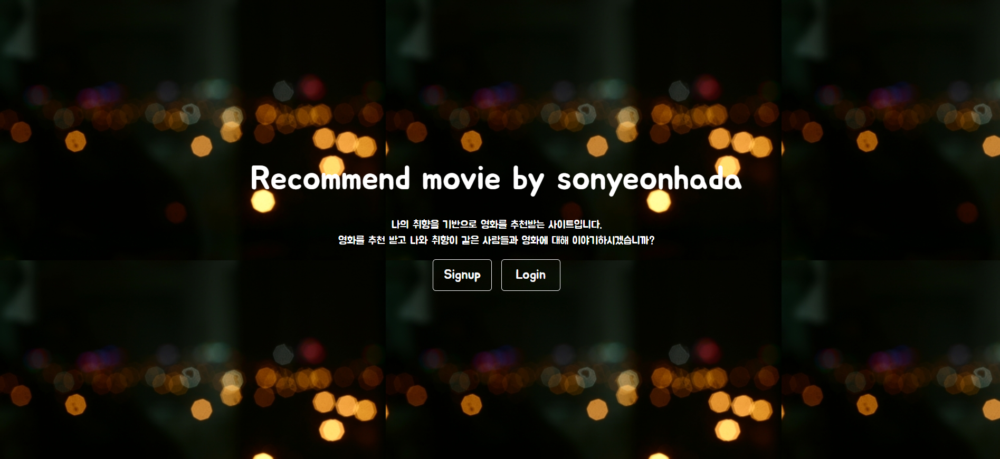


* 회원가입

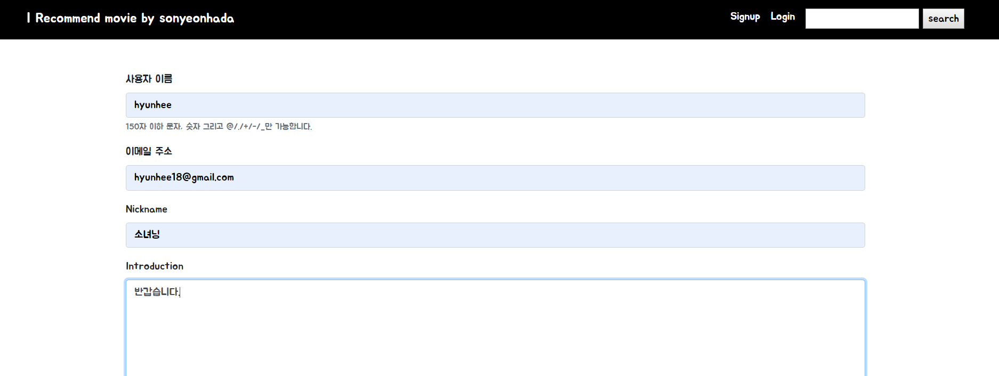


* 좋아하는 영화 선택 페이지

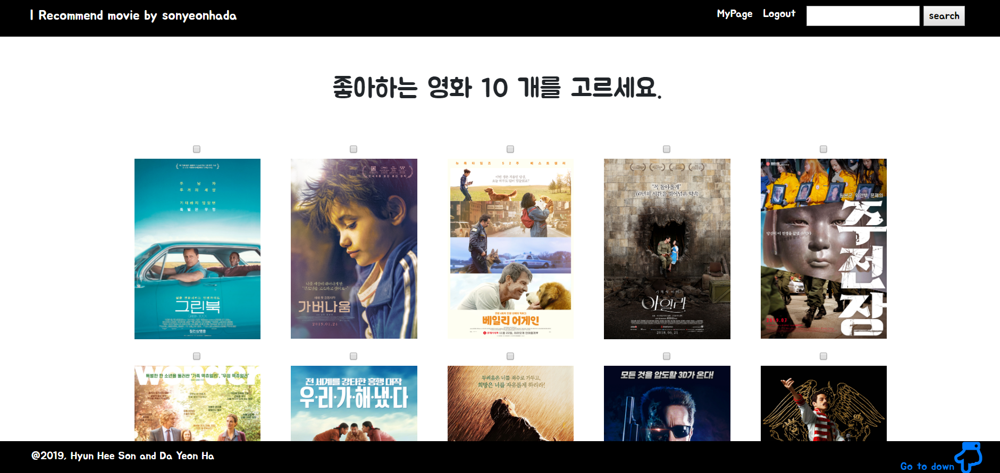


* 모두 선택 후 start 버튼 누르면 회원 홈페이지

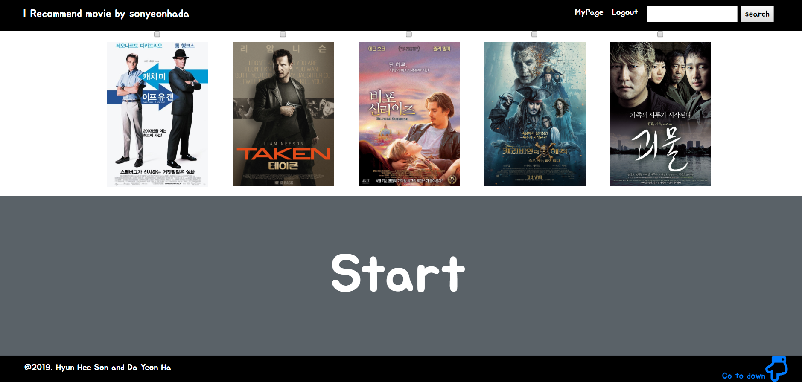


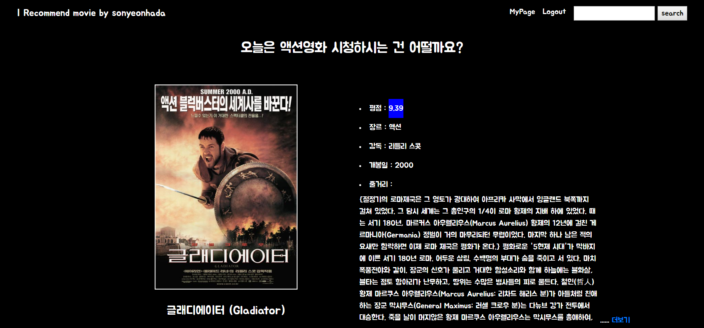


* 하단에 알고리즘을 통해 도출한 `유저의 영화 장르 취향 기반 영화 추천` 과 `나와 비슷한 영화 취향을 가진 User list` 보여줌

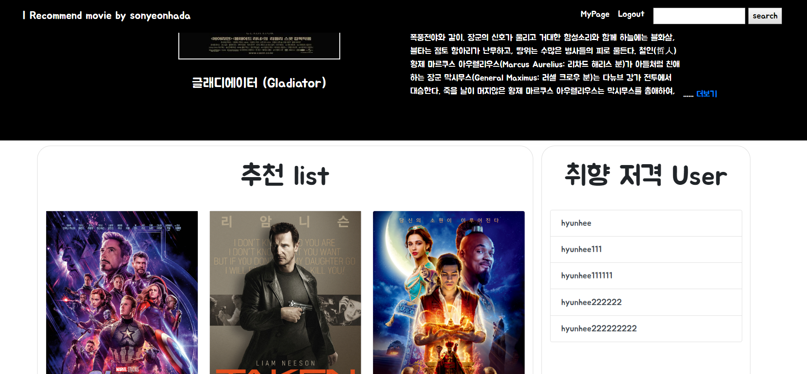


------


#### User_page

* 유저의 `프로필 사진과 기타 정보 변경` 기능

- `좋아요 누른 영화 포스터 목록` 누르면 디테일 페이지 이동, 타 유저가 좋아하는 영화 목록도 열람 가능
- `담벼락 기능` 으로 영화 취향이 비슷한 유저끼리 소통 가능
  - 채팅으로 소통하는 느낌의 사용자 경험을 위해 내가 쓴 글은 담벼락의 오른쪽에, 상대방 유저가 쓴 글은 담벼락 왼쪽에 위치.


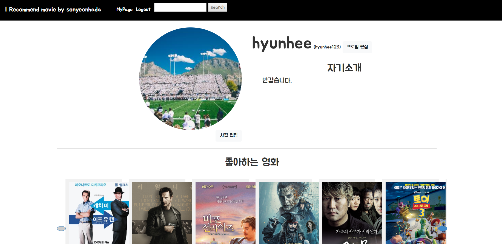


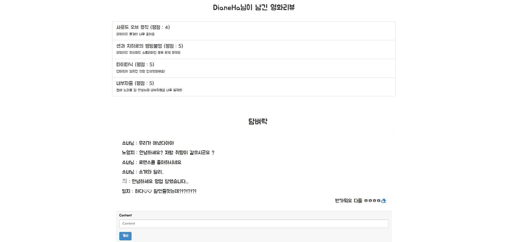


#### Moive_detail

* `영화 상세 정보` 제공
* 유저가 `toggle_like` 로 좋아하는 영화 리스트 아카이빙 가능
* 페이지 하단에서 `review` 와 `평점` 등록 및 삭제 가능


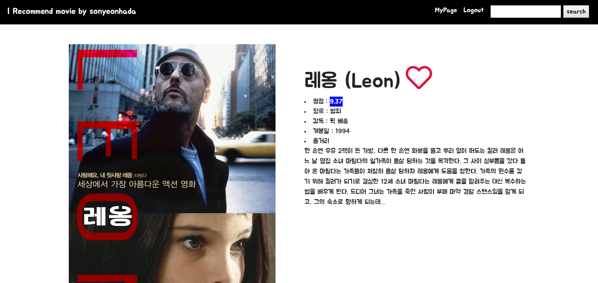


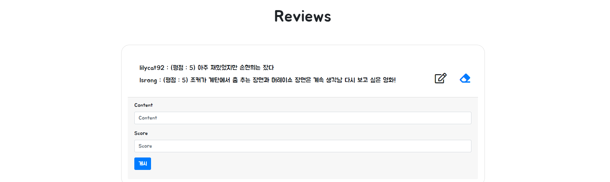


## 5. URL

#### 배포서버 URL

https://quiet-beyond-76918.herokuapp.com/


#### 발표자료 URL

https://docs.google.com/presentation/d/e/2PACX-1vSo1S4w_RrYkt4bYaKy8pGektqbmtsDsPj3T8XZ11XYZ-gJAOIXE55zQUMiBbcHDaXotrQ0A-eqahdz/pub?start=false&loop=false&delayms=3000

## 6. 프로젝트를 마치며

#### 손현희


본 프로젝트를 시작하기에 앞서 영화라는 공통 주제로 좋은 홈페이지를 만들 수 있을 지 걱정이 앞섰다. 좋은 홈페이지를 만들지 못한다면 5개월 간 해온 공부가 헛되지는 건 아닐까 하는 생각에 더 부담되었다. 따라서, 제작에도 촉박한 시간이었지만 기획 전에 내가 생각하는 좋은 홈페이지란 무엇일까를 고민하는데 많은 시간을 투자하였다. 고민 끝에 내린 결론은 좋은 홈페이지는 다시 방문하게 되는 홈페이지였다. 그래서 user가 다시 방문하고 싶도록 홈페이지 내에 커뮤니티를 만들어 영화라는 주제에 관하여 서로 생각을 나누고 공유할 수 있도록 하는 것에 중점을 두었다.

제작에는 오히려 크게 어려움이 없어 놀랐다. 5개월 간의 기간을 헛되이 보낸 것이 아니란 것을 느끼며 뿌듯했다. 또한, 백앤드 개발자가 되고 싶다는 생각으로 코딩을 시작하였는데 프론트앤드에서 생각한대로 구현되고 눈에 직접 보이는 것이 매우 매력적으로 다가왔다. 그러나 아직 javascript 부분에 있어 부족함이 느껴져 아쉬움이 있었다.

앞으로의 프로젝트를 위하여 다음과 같은 다짐을 하고자 한다.
1. 다음 프로젝트 전까지 vue에 대하여 공부하기
2. 프로젝트 시 제작 전 기획을 탄탄히 하기
3. 이번 프로젝트를 하며 느꼈던 의욕과 의지를 잃지 않기
4. 모든 프로젝트에 있어 프로젝트 후 새로 배운 점에 대해 복습하기


#### 하다연


부족함이 많이 느껴지는 프로젝트 기간이었다. 생소한 개발 분야의 공부를 시작하고 나서 그럭저럭 따라가고 있다고 생각했었는데, 프로젝트를 맞이하고 보니 부족한 점 투성이다. 기본 원리나 문법을 제대로 이해하지 않고 애매하게 이해해왔었다. 그래서 그 애매한 지식 때문에 더 헷갈리는 느낌이었다.

개발자에게 '가장 자신있는 언어가 무엇이냐'는 질문이 왜 중요한 질문인지 실감했다. 프로젝트의 범위와 양은 방대하고 대규모의 프로그램이 될 수록 더 많은 사람이 협업을 하게 될 것이다. 그러면 서로가 잘하는 부분을 맡아 그 부분을 잘 해내는 것, 그리고 소통을 잘 하는것. 두 가지가 중요할 것 같다. 지금은 브로드한 범위로 전혀 모르지도 잘 알지도 못하는 느낌이다.

앞으로 다음의 다짐을 지키고 싶다.
1. 한 언어 혹은 한 언어의 한 부분을 알더라도 제대로 동작원리를 이해하는 것. (나의 언어와 지식으로 정리될 정도)
2. 어떤 단계에 있더라도 기본이 중요하다는 것.
3. 가능한 배우는 그때 그때 복습하고 소화해야겠다.

gitflow를 통한 협업도 연습해볼 수 있었는데 각자의 branch에서 작업을 진행한 후 pull request를 보내고 모두가 merge에 동의하면 master에 branch 내용을 merge하는 방식이다. 쓰다보면 각 개발자가 다른 곳에서 동시에 작업하면서도 효과적으로 협업할 수 있을 것 같다! 


